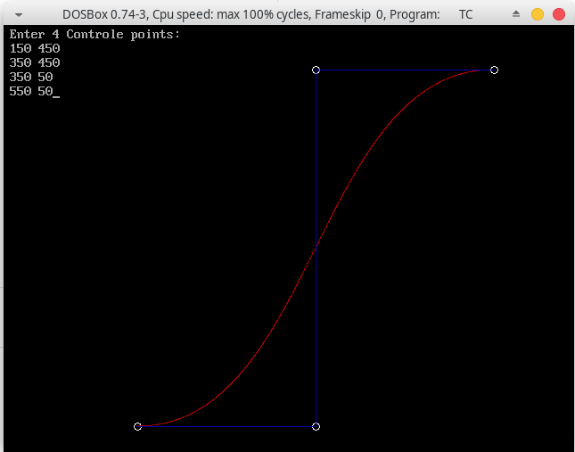

## Algorithms in Computer Graphics

Though there are a lot of the algorithms used for various purposes in graphics, here we'll be dealing with very few of them that are easy to understand, as a beginer.<br /> <br />

These algorithms are are related to the folowing concepts:<br />
> * Line Drawing
> * Line Clipping
> * Circle Drawing
> * Curve Tracing
> * 2D & 3D Transformation
>   * Scaling
>   * Translating
>   * Shearing
>   * Reflecting
>   * Rotating
>   * Projection etc..

Most of these algorithms are from the prescribed practical list of syllabus of B.Sc. (H) Computer Science. Hence, those are placed separatly into [practicals](https://github.com/ravi-prakash1907/Computer-Graphics/tree/master/C%2B%2B%20Programms/practicals) directory. <br />


### Impleted Algorithms:

Following are some ```C++``` programs where the above listed programs are implemented: <br />

1. **Bresenham’s Line Lrawing Algorithm:**<br />


2. **Mid-Point Circle Drawing Algorithm:**<br />


3. **Cohen and Sutherland Line Clipping Algorithm:**<br />


4. **Sutherland Hodgeman Polygon Clipping Algorithm:**<br />


5. **Scan Line Fill Algorithm for Polygon:**<br />
    **Diring the execution of algo.**<br />

    **After complete fill**<br />


6. **2-D Transformations:**<br />
    **Input co-ordinates**<br />

    **Reflection**<br />

    <br />

    **Rotation**<br />

    <br />


7. **3-D Transformations:**<br />
    **3-D Figure**<br />

    **Scaling**<br />

    <br />

    **Perspective Projection**<br />

    <br />


8. **Hermite / Bezier Curve:**<br />


Apart from these, Digital Differential Analyzer(DDA) is also implemented that is one of the earlier algorithms, used for line drawing. <br /><br />

The output of **DDA** is:<br />
